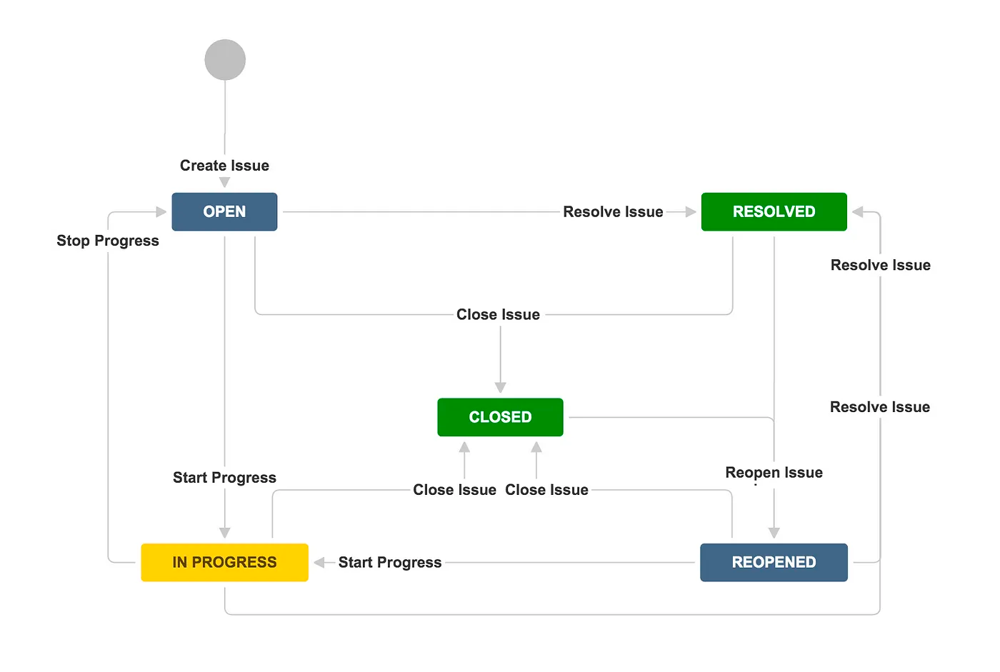

# state_design_pattern_flutter

A new Flutter project.

## Getting Started

This project is a starting point for a Flutter application.

A few resources to get you started if this is your first Flutter project:

- [Lab: Write your first Flutter app](https://docs.flutter.dev/get-started/codelab)
- [Cookbook: Useful Flutter samples](https://docs.flutter.dev/cookbook)

For help getting started with Flutter development, view the
[online documentation](https://docs.flutter.dev/), which offers tutorials,
samples, guidance on mobile development, and a full API reference.

## 1. Research: State Design Pattern Flutter

- Keywords:
    - state design pattern in flutter
    - state design pattern flutter
    - behavioural design patterns in flutter
    - behavioural design patterns
    - state design pattern with example
- Video Title: State Design Pattern in Flutter | Behavioural Design Patterns in Flutter | State
  Design Pattern with Example

## 2. Research: Competitors

**Flutter Videos/Articles**

- 131K: https://youtu.be/N12L5D78MAA
- 229K: https://youtu.be/MGEx35FjBuo
- https://medium.com/flutter-community/flutter-design-patterns-6-state-be06cb05525c
- https://scottt2.github.io/design-patterns-in-dart/state/

**Android/Swift/React Videos**

- 21K: https://youtu.be/abX4xzaAsoc
- 8.7K: https://youtu.be/rzU8CMNuFMM
- 1.7K: https://youtu.be/pvgnzzgnLoU
- 131K: https://youtu.be/N12L5D78MAA
- 229K: https://youtu.be/MGEx35FjBuo
- 15K: https://youtu.be/8O-Us2BphU4
- 14K: https://youtu.be/8jy_fXI1OzA?list=PLmCsXDGbJHdixVCTSEkvlh3z4Abx17Sd6
- 21K: https://youtu.be/abX4xzaAsoc
- 4.3K: https://youtu.be/8rynRTOr4mE
- https://www.geeksforgeeks.org/state-design-pattern
- https://www.tutorialspoint.com/design_pattern/state_pattern.htm
- https://www.digitalocean.com/community/tutorials/state-design-pattern-java
- https://www.baeldung.com/java-state-design-pattern
- https://refactoring.guru/design-patterns/state/java/example
- https://sourcemaking.com/design_patterns/state
- https://home.csulb.edu/~pnguyen/cecs277/lecnotes/State%20Design%20Pattern%20in%20Java.pdf
- https://howtodoinjava.com/design-patterns/behavioral/state-design-pattern/
- https://refactoring.guru/design-patterns/state/swift/example
- https://khawerkhaliq.com/blog/swift-design-patterns-state-pattern/
- https://github.com/kingreza/Swift-State
- https://medium.com/cocoaacademymag/how-use-state-design-pattern-to-create-a-stateful-viewcontroller-78c224781918
- http://www.coursegalaxy.com/design-patterns/state-swift.html
- https://agostini.tech/2018/05/13/design-patterns-in-swift-state/
- https://dev.to/sergeyleschev/swift-design-patterns-state-pattern-5ej4
- https://subscription.packtpub.com/book/application-development/9781785887611/5/ch05lvl1sec26/the-state-pattern
- https://www.kodeco.com/books/design-patterns-by-tutorials/v3.0/chapters/15-state-pattern
- https://blog.logrocket.com/guide-understanding-react-state-patterns/
- https://www.komododigital.co.uk/insights/react-and-react-native-design-patterns-solid-principles/
- https://www.uxpin.com/studio/blog/react-design-patterns/

**Great Features**

- The state design pattern is a behavioral design pattern that allows an object to change its
  behavior based on its current state.

**Problems from Videos**

- NA

**Problems from Flutter Stackoverflow**

- https://stackoverflow.com/questions/4935806/how-to-use-state-pattern-correctly
- https://stackoverflow.com/questions/55797612/why-state-design-pattern-over-if-else
- https://stackoverflow.com/questions/75712188/alternatives-to-state-design-pattern
- https://stackoverflow.com/questions/73686872/how-does-state-design-pattern-satisfy-the-open-closed-design-principle
- https://stackoverflow.com/questions/56147224/implementation-of-the-state-pattern
- https://stackoverflow.com/questions/63728128/state-machine-design-pattern
- https://stackoverflow.com/questions/73521931/how-to-implement-state-design-pattern-without-violating-interface-segregation-pr
- https://stackoverflow.com/questions/40318196/state-pattern-java

## 3. Video Structure

**Main Points / Purpose Of Lesson**

1. In this video lesson, you will learn how to use state design pattern in flutter and dart to allow
   an object to alter its behavior when its internal state changes.
2. Main points:
    - **State** defines an interface that encapsulates the state-specific behaviour and methods.
      These methods should make sense for all ConcreteStates, there should be no methods defined
      which will never be called from a specific implementation of the State interface.
    - **ConcreteStates**: each class implements a behaviour associated with a state of the Context.
      State objects may reference the Context to obtain any required information from the context or
      to perform the state transition by replacing the state object linked to the Context class (via
      the exposed setter method).
    - **Client** uses the Context object to reference the current state and initiate its transition,
      also it may set the initial state for the Context class if needed.
3. The State design pattern should be used when you have an object that behaves differently
   depending on its current state, the number of states is enormous, and the state-specific code
   changes frequently. By encapsulating each state and its implementation details in a separate
   class, you can add new states more easily, also you can change the existing states independently
   of each other.

**The Structured Main Content**

# State Design Pattern Flutter

## Definition:

The State is a behavioural design pattern.

It allows an object to alter its behaviour when its internal state changes. The object will appear
to change its class.

## Analysis:

Different states of a task can be:



**State** defines an interface that encapsulates the state-specific behaviour and methods. These
methods should make sense for all ConcreteStates, there should be no methods defined which will
never be called from a specific implementation of the State interface.

It defines an interface or abstract class that encapsulates the behavior associated with a
particular state of the context.

**ConcreteStates** implements a behaviour associated with a state of the Context. State objects may
reference the Context to obtain any required information from the context or to perform the state
transition by replacing the state object linked to the Context class (via the exposed setter method)
.

It implements the state interface and provides the concrete implementation of the behavior
associated with a specific state.

**Client** uses the Context object to reference the current state and initiate its transition, also
it may set the initial state for the Context class if needed.

It represents the object that maintains a reference to the current state object. It interacts with
the state objects through the state interface.

## Implementation:

In `main.dart`:

1. Define State interface class named `State`. `pressPlay` method which is accepting an object of
   type `Player`, will be used where classes are implementing this `State` class.
   ```dart
   abstract interface class State {
     void pressPlay(Player player);
   }
   ```
2. Define a Context class named `Player`.
    - Initialize its `_state` variable of type `State` class and declare this variable
      to `StandByState` which is extending `State` class.
    - `setState()` method replaces the old state with the new state.
    - `pressPlay()` method calls the pressPlay() method of `State` class.

   ```dart
   class Player {
   late State _state;

   Player() {
   _state = StandbyState();
   }

   void setState(State newState) => _state = newState;

   void pressPlay() => _state.pressPlay(this);
   }
   ```
3. Define concrete state classes. All these classes are implementing `State` class, so they
   override `pressPlay()` method of `State` class.
    - `StandbyState` prints `Starting playback` and set the new state to the `PlayingState()`.
    - `StandbyState` prints `Pausing playback` and set the new state to the `PausedState()`.
    - `StandbyState` prints `Resuming playback` and set the new state to the `PlayingState()`.

```dart
// Concrete state classes
class StandbyState implements State {
  @override
  void pressPlay(Player player) {
    print("Starting playback.");
    player.setState(PlayingState());
  }
}

class PlayingState implements State {
  @override
  void pressPlay(Player player) {
    print("Pausing playback.");
    player.setState(PausedState());
  }
}

class PausedState implements State {
  @override
  void pressPlay(Player player) {
    print("Resuming playback.");
    player.setState(PlayingState());
  }
}
   ```

4. In `main()` method, initialize player object. Call the `player.pressPlay()` everytime. It
   allows `player` object to change its behavior based on its current state.

```dart
// Usage example
void main() {
  final player = Player();

  // Initial state is StandbyState
  player.pressPlay(); // Output: Starting playback.

  // State changes to PlayingState
  player.pressPlay(); // Output: Pausing playback.

  // State changes to PausedState
  player.pressPlay(); // Output: Resuming playback.

  // State changes back to PlayingState
  player.pressPlay(); // Output: Pausing playback.
}
```

The `Player` class acts as the Context, the `State` interface defines the contract, and the concrete
state classes (`StandbyState`, `PlayingState`, `PausedState`) implement the State interface.

The `main` function demonstrates the usage by creating a `Player` object and invoking
the `pressPlay()` method to transition between different states, producing the corresponding
outputs.

### Strategy vs State

You may have noticed, that the structure of the State design pattern looks really similar to
the Strategy. The main difference between these patterns — in the State pattern, the particular
states may be aware of each other, while specific strategies almost never know any details about
other implementations of the strategy.